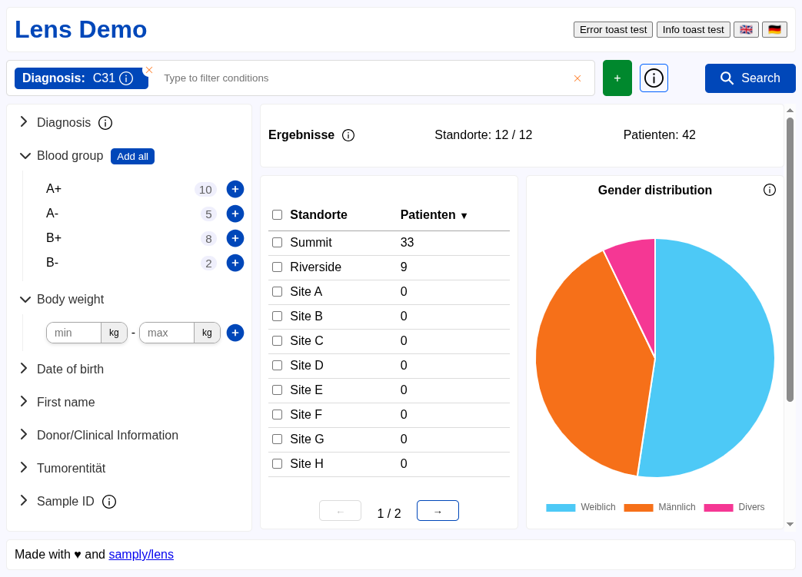

# Lens

Lens is a front-end library for building search tools in the medical space to answer questions such as:

> What is the age distribution of patients with lung cancer across participating hospitals?

It is used at Deutsches Krebsforschungszentrum to build tools for cancer research such as the [BBMRI-ERIC Locator](https://www.bbmri-eric.eu/news-events/locator-a-powerful-tool-to-enhance-visibility-and-findability-of-samples-and-data-in-europes-biobanks/) and the [CCP Explorer](https://dktk.dkfz.de/en/clinical-platform/ccp-explorer).

You can try out the [interactive demo](https://samply.github.io/lens/demo/) that showcases the functionality of a typical Lens-based application. Note that in the demo results are hardcoded and do not reflect your query.



## Documentation

Get started with Lens by following the [creating a new application](https://samply.github.io/lens/book/guide/new-app.html) guide. The guide is part of the [Lens Book](https://samply.github.io/lens/book/) which is split into chapters:

- [User Guide](https://samply.github.io/lens/book/guide/index.html) for users of the Lens library
- [Development](https://samply.github.io/lens/book/development/index.html) for developers and contributors
- [Components](https://samply.github.io/lens/book/components/index.html) documents individual web components
- [Release notes](https://samply.github.io/lens/book/releases/index.html) with migration guides

Documentation for the TypeScript API of Lens is available as [TypeDoc](https://samply.github.io/lens/docs/).

## Development

To get started working on Lens clone the repository and run:

```
npm install
npm run dev
```

This will start the demo application that you can use to test your changes to the web components and library.

Refer to the [development chapter](https://samply.github.io/lens/book/development/index.html) of the Lens Book for more information.
