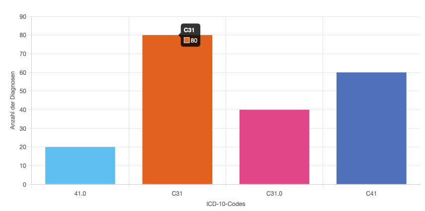

# Chart

The `lens-chart` component provides a styled wrapper for visualizing data using Chart.js. It handles dynamic display behaviors like toggling chart visibility, showing hints, and rendering a fallback message when no data is available. Some Options are set via [ChartOption](https://samply.github.io/lens/docs/types/ChartOption.html) and some are set via props.



The component is constructed from a title and a chart. There is a slot after the title and chart for customization. The chart does render either totals or stratifier from the [lens-results](../guide/results.md).

---

## Props

Non of the props are required, however without `datakey` prop the chart does not known which data to render and will be empty.

| Name                   | Type                  | Default    | Description                                                                                                                                                                                                                                                                                       |
| ---------------------- | --------------------- | ---------- | ------------------------------------------------------------------------------------------------------------------------------------------------------------------------------------------------------------------------------------------------------------------------------------------------- |
| `title`                | `string`              | `""`       | Title displayed above the chart.                                                                                                                                                                                                                                                                  |
| `indexAxis`            | `string`              | `"x"`      | Determines the main axis for data display. Use 'y' to flip the chart orientation (horizontal bars instead of vertical)                                                                                                                                                                            |
| `xAxisTitle`           | `string`              | `""`       | Title below the x-axis.                                                                                                                                                                                                                                                                           |
| `yAxisTitle`           | `string`              | `""`       | Title below the y-axis.                                                                                                                                                                                                                                                                           |
| `clickToAddState`      | `boolean`             | `"false"`  | With this prop set to true it will add the clicked item to the search. The rendered element must have the same name as the catalogue item.                                                                                                                                                        |
| `headers`              | `Map<string, string>` | `""`       | Maps internal result keys to human-readable labels for display. For example, mapping "gender_m" to "Male" or "age_65_plus" to "65+ years".                                                                                                                                                        |
|                        |
| `displayLegends`       | `boolean`             | `""`       | With this option a legend of all data items is render below the graph.                                                                                                                                                                                                                            |
| `chartType`            | `ChartTypeRegistry`   | `""`       | Which type of chart is rendered, see [types](https://www.chartjs.org/docs/latest/api/interfaces/ChartTypeRegistry.html)                                                                                                                                                                           |
| `scaleType`            | `string`              | `"linear"` | Sets the scale type of the chart. Either "linear" or "logarithmic"                                                                                                                                                                                                                                |
| `enableSorting`        | `boolean`             | `"true"`   | Enables sorting buttons for chart                                                                                                                                                                                                                                                                 |
| `dataKey`              | `string`              | `""`       | Looks up the data in the Result store.                                                                                                                                                                                                                                                            |
| `perSite`              | `boolean`             | `"false"`  | When true, displays aggregated totals per site/location instead of overall totals.                                                                                                                                                                                                                |
| `groupRange`           | `number`              | `""`       | lets the user define a range for the labels when only single values are used eg. '60' -> '60 - 69'.                                                                                                                                                                                               |
| `groupingDivider`      | `string`              | `""`       | Is the char that combines subgroups into their supergroups like C30, C31.1 and C31.2 into C31                                                                                                                                                                                                     |
| `filterRegex`          | `string`              | `""`       | Filters data according to the provided regular expression.                                                                                                                                                                                                                                        |
| `groupingLabel`        | `string`              | `""`       | Sets divider for grouping stratifier together.                                                                                                                                                                                                                                                    |
| `viewScales`           | `boolean`             | `"true"`   | Displays the scales on the x-axis and y- axis.                                                                                                                                                                                                                                                    |
| `backgroundColor`      | `string[]`            | `""`       | Expects an array with hex color strings. These colors will be set in the order which are provided. There is no possibility to map results to certain colors. If no color is set, there are the lens default colors. If you provide more results then colors, they will repeat from the beginning. |
| `backgroundHoverColor` | `string[]`            | `""`       | Similar functionality as the background color, instead the hover colors.                                                                                                                                                                                                                          |

---

## Example

```svelte
<lens-chart
    title="Gender"
    datakey="gender"
    chartType="pie"
    displayLegends="true"
></lens-chart>
```

---

## Styling

| Part Name                          | Description                                                   |
| ---------------------------------- | ------------------------------------------------------------- |
| `lens-chart-wrapper`               | Root wrapper with grid layout and background color.           |
| `lens-chart-info-button-wrapper`   | Positioned top-right; holds the optional info button.         |
| `lens-chart-title`                 | Renders the chart’s title, centered.                          |
| `lens-chart-overlay`               | Covers the chart area to display messages (e.g. no data).     |
| `lens-chart-no-data-available`     | Styled message shown when there is no chart data.             |
| `lens-chart-container-min-width-0` | Wraps the canvas; forces `min-width: 0` for responsiveness.   |
| `lens-chart-canvas`                | The chart rendering surface. Includes width/max-height rules. |
| `lens-chart-sort-buttons`          | The container for the sort buttons                            |
| `lens-chart-sort-button`           | Styling of a sort button                                      |
| `lens-chart-sort-button:hover`     | Styling of a hovered sort button                              |
| `lens-chart-sort-button:active`    | Styling of an active sort button                              |
| `lens-chart-sort-button:focus`     | Styling of a focused sort button                              |
