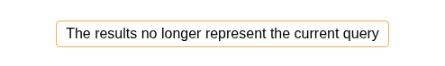

# Search Modified Display

`<lens-search-modified-display>` displays a visual cue when the current query has been modified:



## Usage

Include it like this:

```
<lens-search-modified-display></lens-search-modified-display>
```

Or customize the message as follows:

```html
<lens-search-modified-display>
    You have unsaved changes. Please click "Search" to update results.
</lens-search-modified-display>
```

## Styling

| Part Name                             | Description                                      |
| ------------------------------------- | ------------------------------------------------ |
| `lens-query-modified-display-wrapper` | Wraps the content and applies border and spacing |

### Example

```css
lens-search-modified-display::part(lens-query-modified-display-wrapper) {
    background-color: var(--light-orange);
    color: var(--dark-orange);
    font-weight: bold;
}
```
