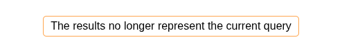

# Search Modified Display

`<SearchModifiedDisplay>` displays a visual cue when the current query has been modified:



## Usage

Include it like this:

```svelte
<SearchModifiedDisplay />
```

You can customize the text using [translations](../guide/translations.md):

```
"texts": {
    "query_modified": {
        "en": "My custom text"
    }
}
```

## Styling

| Part Name                             | Description                                      |
| ------------------------------------- | ------------------------------------------------ |
| `lens-query-modified-display-wrapper` | Wraps the content and applies border and spacing |

### Example

```css
SearchModifiedDisplay::part(lens-query-modified-display-wrapper) {
    background-color: var(--light-orange);
    color: var(--dark-orange);
    font-weight: bold;
}
```
