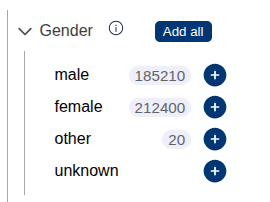

# Facet counts

Lens can query facet counts from [Spot](https://github.com/samply/spot) and display them in the catalogue. Facet counts are the number of results one would get when only searching for that criteria.



To enable facet counts add the following to the Lens options:

```json
"facetCount": {
    "hoverText": {
        "gender": "Matching patients for this criterion only",
        "diagnosis": "Total number of this diagnosis across all patients",
        "sample_kind": "Matching samples for this criterion only"
    }
},
```

`hoverText` controls the text that is displayed when hovering the mouse over the number chips. You also have to set the Spot URL in the Lens options:

```json
"spotUrl": "https://locator-dev.bbmri-eric.eu/backend"
```

Lens POSTs an array of sites (e.g. `{"sites": ["berlin", "munich"]}`) to the appropriate Spot endpoint and expects facet counts in the following format:

```json
{
    "diagnosis": {
        "C34.0": 26,
        "C34.2": 28,
        "C34.8": 25
    },
    "gender": {
        "female": 31,
        "male": 43
    }
}
```
