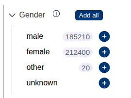

# Facet counts

Lens can query facet counts from a backend and display them in the catalogue. Facet counts are roughly speaking the number of results one would get when only searching for that criteria.



To enable facet counts add the following options:

```json
"facetCount": {
    "backendUrl": "http://localhost:5124/prism",
    "hoverText": {
        "gender": "Matching patients for this criterion only",
        "diagnosis": "Total number of this diagnosis across all patients",
        "sample_kind": "Matching samples for this criterion only"
    }
},
```

`hoverText` controls the text that is displayed when hovering the mouse over the number chips.

Lens POSTs an array of sites (e.g. `{"sites": ["berlin", "munich"]}`) to the endpoint and expects facet counts in the following format:

```json
{
    "diagnosis": {
        "C34.0": 26,
        "C34.2": 28,
        "C34.8": 25
    },
    "gender": {
        "female": 31,
        "male": 43
    }
}
```
