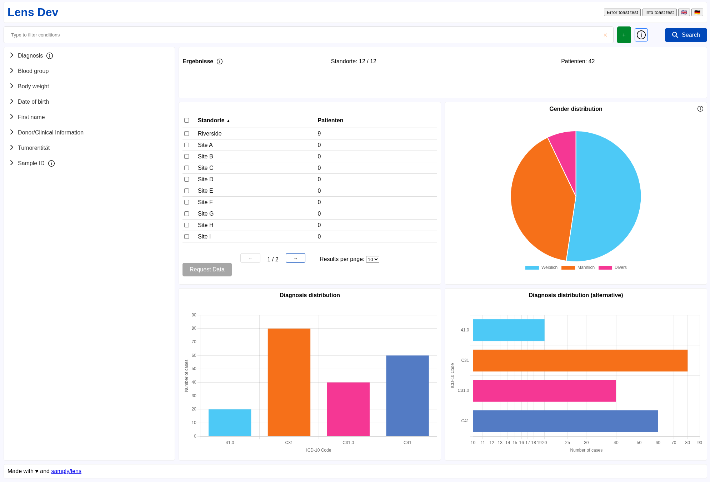

# Creating a new application

Lens is a Svelte component library that works best with SvelteKit applications. This guide focuses on compatibility with other projects in the [Samply organization](https://github.com/samply), so we use SvelteKit as the frontend framework and Docker for deployment.

To create a new SvelteKit application run `npx sv create my-app`. Use the minimal template with TypeScript syntax and select Prettier and ESLint when prompted.

Now `cd` to the new directory and install Lens:

```bash
npm install @samply/lens
```

## Prettier config

The Prettier config created by `sv create` uses tabs and sets the print width to 100 [against the recommendation of Prettier](https://prettier.io/docs/options#print-width). We recommend to remove these options from `.prettierrc` and use the Prettier defaults with the Svelte plugin only:

```json
{
    "plugins": ["prettier-plugin-svelte"],
    "overrides": [
        {
            "files": "*.svelte",
            "options": {
                "parser": "svelte"
            }
        }
    ]
}
```

## Configuring the root route

Typically your application will only use the root route at `src/routes`. We will import the Lens CSS bundle and render the main application component. Change the content of `src/routes/+page.svelte` to:

```html
<script lang="ts">
    // Import Lens CSS bundle
    import "@samply/lens/styles/index.css";

    import App from "../App.svelte";
</script>

<App />
```

Note that the route file `+page.svelte` requires the `+` prefix.

## The application component

Your main application code lives in the application component. Create the file `src/app.css` and leave it empty and create `src/App.svelte` with the following content:

```html
<script lang="ts">
    import "./app.css";
    import { SearchButton } from "@samply/lens";
</script>

<SearchButton />
```

Now run `npm run dev` and open <http://localhost:5173/> in your browser. You should see a search button in the top left corner of the page.

## Options and catalogue

Your application must pass two objects to Lens. The [LensOptions](https://samply.github.io/lens/docs/types/LensOptions.html) object contains general configuration options and the [Catalogue](https://samply.github.io/lens/docs/types/Catalogue.html) object describes what users can search for. You can define these objects in TypeScript but many applications in the Samply organization define them in JSON files.

Assuming you are using JSON files, create the file `src/config/options.json` containing the empty object `{}` and the file `src/config/catalogue.json` with the following content:

```json
[
    {
        "key": "rh_factor",
        "name": "Rh factor",
        "fieldType": "single-select",
        "type": "EQUALS",
        "criteria": [
            {
                "key": "rh_positive",
                "name": "Rh+"
            },
            {
                "key": "rh_negative",
                "name": "Rh-"
            }
        ]
    }
]
```

Add the following to the top of `src/App.svelte` to load the JSON files and pass the objects to Lens:

```html
<script lang="ts">
    import { onMount } from "svelte";
    import {
        setOptions,
        setCatalogue,
        SearchBar,
        Catalogue,
        type LensOptions,
        type Catalogue as CatalogueType,
    } from "@samply/lens";
    import options from "./config/options.json";
    import catalogue from "./config/catalogue.json";
    onMount(() => {
        setOptions(options as LensOptions);
        setCatalogue(catalogue as CatalogueType);
    });
</script>

<SearchBar />
<Catalogue />
```

When you run `npm run dev` you should see the search bar and the catalogue component with the "Rh factor" entry. Open the "Rh factor" entry and click the plus icons next to Rh+ and Rh- in order to add them to the search bar.

**NOTE:** The `options.json` file is being initialized with an empty object for now, but will be populated in the later parts of this book. Whenever the book tells you to add something to the Lens options it is implied that you add it to this file.

### Schema validation

Lens includes JSON schema definitions for the options and the catalogue type. Create the script `scripts/validate-json-schema.bash` to validate your JSON files against the schema definitions:

```bash
set -e # Return non-zero exit status if one of the validations fails
npx ajv validate -c ajv-formats -s node_modules/@samply/lens/dist/schema/options.schema.json -d src/config/options.json
npx ajv validate -c ajv-formats -s node_modules/@samply/lens/dist/schema/catalogue.schema.json -d src/config/catalogue.json
```

Then install the required dependencies and test the script:

```
npm install ajv-cli ajv-formats --save-dev
bash scripts/validate-json-schema.bash
```

You can also configure VS Code to validate your JSON files against the schema definitions. This will show validation errors in your editor and provide IntelliSense. To do so add the following configuration to your projects `.vscode/settings.json`:

```json
{
    "json.schemas": [
        {
            "fileMatch": ["catalogue*.json"],
            "url": "./node_modules/@samply/lens/dist/schema/catalogue.schema.json"
        },
        {
            "fileMatch": ["options*.json"],
            "url": "./node_modules/@samply/lens/dist/schema/options.schema.json"
        }
    ]
}
```

### Test environment

It is a common requirement to load different options in test and production. You can achieve this by using [a feature of SvelteKit](https://svelte.dev/tutorial/kit/env-dynamic-public) that makes environment variables from the server available in the browser. Applications in the Samply organization commonly accept the following environment variables:

- `PUBLIC_ENVIRONMENT`: Accepts the name of the environment, e.g. `production` or `test`
- `PUBLIC_SPOT_URL`: Overwrites the URL of the [Spot](https://github.com/samply/spot) backend that your application queries

Just like you created a JSON file `src/config/options.json`, create a `src/config/options-test.json` (to start with, it can also contain an empty object `{}`).

Now you can handle these variables as follows:

```html
<script lang="ts">
    import type { LensOptions } from "@samply/lens";
    import { env } from "$env/dynamic/public";
    import optionsProd from "./config/options.json";
    import optionsTest from "./config/options-test.json";
    ...
    onMount(() => {
        let options: LensOptions = optionsProd;
        if (env.PUBLIC_ENVIRONMENT === 'test') {
            options = optionsTest;
        }
        if (env.PUBLIC_SPOT_URL) {
            options.spotUrl = env.PUBLIC_SPOT_URL;
        }
        setOptions(options);
    });
    ...
</script>
```

## Reading the query and showing results

When the user clicks the search button, a typical application will read the current query from the search bar, send the query to some kind of backend to get results, and then pass the results to Lens so it can show them.

Add the following to `src/App.svelte` to print the current query to the console when the search button is clicked and show some hardcoded results in a pie chart. Of course, in a real application the results would depend on the query. For example a user might want to know the gender distribution of people who are Rh positive.

```html
<script lang="ts">
    import { getAst, setSiteResult, Chart } from "@samply/lens";
    window.addEventListener("lens-search-triggered", () => {
        console.log("AST:", JSON.stringify(getAst()));

        setSiteResult("berlin", {
            totals: {},
            stratifiers: {
                gender: {
                    female: 9,
                    male: 3,
                },
            },
        });
    });
</script>

<Chart
    title="Gender distribution"
    dataKey="gender"
    chartType="pie"
    displayLegends={true}
/>
```

You can read more about [queries and the AST](./query.md) and about [showing results](./results.md) in the dedicated guides.

## Layout and design

We are maintaining a demo application in the Lens repository that showcases the layout and design of a typical application.



You can try out an interactive version [here](https://samply.github.io/lens/demo/) and find the source code in the [`demo.svelte`](https://github.com/samply/lens/blob/main/demo.svelte) file. The demo application uses a layout where the header and footer are always visible and the catalogue and main content areas are scrollable independently. You have the option to copy the layout or parts of the layout from the demo application and adapt them to your needs.

It is also possible to customize the styles of Lens components using CSS, see the [overwriting styles](./overwriting-styles.md) guide for details.

## Deploying using Docker

We recommend that projects in the Samply organization follow these deployment practices. We will use Node.js inside Docker. Run `npm i -D @sveltejs/adapter-node` and change the adapter in `svelte.config.js`:

```diff
-import adapter from '@sveltejs/adapter-auto';
+import adapter from '@sveltejs/adapter-node';
```

Then you can remove `@sveltejs/adapter-auto` from `package.json`. Now create a `Dockerfile` with the following content:

```dockerfile
FROM node:22-alpine AS builder
WORKDIR /app

# Install dependencies first to leverage Docker cache
COPY package.json package-lock.json ./
RUN npm ci

# Copy the rest of the application
COPY vite.config.ts svelte.config.js ./
COPY src ./src
COPY static ./static

# Build the SvelteKit project
RUN npm run build

# Production image
FROM node:22-alpine AS runner
WORKDIR /app
COPY --from=builder /app/build ./build
EXPOSE 3000
CMD ["node", "build"]
```

## GitHub Actions

You can use GitHub Actions to automatically run lints and build a Docker image when a pull request is opened or code is pushed. You can copy the following into `.github/workflows/ci.yml` and adjust it to your needs. It runs Prettier, ESLint, svelte-check (checks for TypeScript errors) and validates your catalogue and options JSON files. If these checks are successful it uses the [Samply Docker CI](https://github.com/samply/github-workflows/blob/main/.github/workflows/docker-ci.yml) to build a Docker image and push it to Docker Hub or the GitHub Container Registry.

```yaml
name: CI

on:
    pull_request:
    push:
    workflow_dispatch:

jobs:
    linting:
        runs-on: ubuntu-latest
        steps:
            - uses: actions/checkout@v4
            - uses: actions/setup-node@v6
            - run: npm ci
            - run: npx prettier --check .
            - run: npx eslint .
            - run: npx svelte-check
            - run: bash scripts/validate-json-schema.bash

    docker:
        needs: linting
        uses: samply/github-workflows/.github/workflows/docker-ci.yml@main
        with:
            image-name: "samply/your-project"
            #push-to: auto
            #build-context: '.'
            #build-file: './Dockerfile'
            #build-platforms: "linux/amd64"
        secrets:
            DOCKERHUB_USERNAME: ${{ secrets.DOCKERHUB_USERNAME }}
            DOCKERHUB_TOKEN: ${{ secrets.DOCKERHUB_TOKEN }}
```
