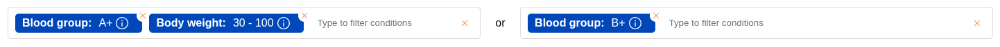

# Querying a backend

Lens has two representations of the query in the search bar: the query store and the AST.

## Query store

Once a user selects an element from the catalogue, it is added to the query store. The query store is of type [`QueryItem[][]`](https://samply.github.io/lens/docs/types/QueryItem.html), where a `QueryItem` represents a chip in the search bar and the outer list represents a logical OR operation and the inner list a logical AND operation. Take for example this query:



The query searches for patients with blood group A- and a body weight between 30 and 100 as well as patients with blood group B+ regardless of their body weight. In the query store this query is represented as follows:

```json
[
    [
        {
            "id": "10254884-b969-4bb2-8da9-d40eeb08586e",
            "key": "blood-group",
            "name": "Blood group",
            "type": "EQUALS",
            "system": "",
            "values": [
                {
                    "name": "A+",
                    "value": "A+",
                    "queryBindId": "7003ba31-2523-4e38-ba56-adf54dbf05cb"
                }
            ]
        },
        {
            "id": "babb673e-43ee-4e9b-8d81-0b7f3d1e41d3",
            "key": "body_weight",
            "name": "Body weight",
            "type": "BETWEEN",
            "values": [
                {
                    "name": "30 - 100",
                    "value": {
                        "min": 30,
                        "max": 100
                    },
                    "queryBindId": "8ac6ad91-4f7a-4709-b701-eed7968ceb12"
                }
            ]
        }
    ],
    [
        {
            "id": "4fc693e6-7865-4075-a84f-66afab0db7a0",
            "key": "blood-group",
            "name": "Blood group",
            "type": "EQUALS",
            "system": "",
            "values": [
                {
                    "name": "B+",
                    "value": "B+",
                    "queryBindId": "250d0bc1-b39d-47b0-98d8-e59a06797fd2"
                }
            ]
        }
    ]
]
```

Applications can read and write the query store using the [`getQueryStore`](https://samply.github.io/lens/docs/functions/getQueryStore.html) and [`setQueryStore`](https://samply.github.io/lens/docs/functions/setQueryStore.html) functions.

## AST

To allow external systems such as databases and APIs to understand the query, the internal query store is transformed into an AST (Abstract Syntax Tree). The AST is a tree structure with the [`AstTopLayer`](https://samply.github.io/lens/docs/types/AstTopLayer.html) type for branches and the [`AstBottomLayerValue`](https://samply.github.io/lens/docs/types/AstBottomLayerValue.html) for leaves. Generally the AST structure allows arbitrarily nesting `AND` and `OR` operations, although the `AST` as generated by Lens always has an outer `OR` operation and an inner `AND` operation to reflect the struture of the query store. The aforementioned query looks as follows in AST form:

```json
{
    "operand": "OR",
    "children": [
        {
            "operand": "AND",
            "children": [
                {
                    "key": "blood-group",
                    "operand": "OR",
                    "children": [
                        {
                            "key": "blood-group",
                            "type": "EQUALS",
                            "system": "",
                            "value": "A+"
                        }
                    ]
                },
                {
                    "key": "body_weight",
                    "operand": "OR",
                    "children": [
                        {
                            "key": "body_weight",
                            "type": "BETWEEN",
                            "system": "",
                            "value": {
                                "min": 30,
                                "max": 100
                            }
                        }
                    ]
                }
            ]
        },
        {
            "operand": "AND",
            "children": [
                {
                    "key": "blood-group",
                    "operand": "OR",
                    "children": [
                        {
                            "key": "blood-group",
                            "type": "EQUALS",
                            "system": "",
                            "value": "B+"
                        }
                    ]
                }
            ]
        }
    ]
}
```

Applications can get the AST from the search bar using the [`getAst`](https://samply.github.io/lens/docs/functions/getAst.html) function.

## Querying a Focus instance

In the samply organization [Focus](https://github.com/samply/focus) is commonly used to parse the AST and execute the query. Because Focus only communicates over the [Beam](https://github.com/samply/beam) protocol, [Spot](https://github.com/samply/spot) is required as an intermediary. Applications can query Focus by listening for the `lens-search-triggered` event and sending the AST to the backend in the appropriate form:

```ts
import { getAst, clearSiteResults, querySpot } from "@samply/lens";

let abortController = new AbortController();
window.addEventListener("lens-search-triggered", () => {
    abortController.abort();
    abortController = new AbortController();
    clearSiteResults();

    const query = btoa(
        JSON.stringify({
            lang: "ast",
            payload: btoa(
                JSON.stringify({ ast: getAst(), id: crypto.randomUUID() }),
            ),
        }),
    );
    querySpot(backendUrl, siteList, query, abortController.signal, (result) => {
        // This is called once per site when its result is received.
    });
});
```

Learn how to pass results to Lens in the [Showing results](./results.md) guide.

### Querying Focus with CQL

Some applications send CQL queries to Focus. In this case you need AST to CQL translation code in your application. You can get started by copying and adjusting the [`ast-to-cql-translator.ts`](https://github.com/samply/ccp-explorer/blob/main/src/lib/ast-to-cql-translator.ts), [`cqlquery-mappings.ts`](https://github.com/samply/ccp-explorer/blob/main/src/lib/cqlquery-mappings.ts) and [`measures.ts`](https://github.com/samply/ccp-explorer/blob/main/src/measures.ts) files from the CCP explorer repository. Sending the query would then look as follows:

```ts
import {
    getAst,
    clearSiteResults,
    buildLibrary,
    buildMeasure,
    querySpot,
} from "@samply/lens";

let abortController = new AbortController();
window.addEventListener("lens-search-triggered", () => {
    abortController.abort();
    abortController = new AbortController();

    // AST to CQL translation
    const cql = translateAstToCql(
        getAst(),
        false,
        "DKTK_STRAT_DEF_IN_INITIAL_POPULATION",
        measures,
    );
    const lib = buildLibrary(cql);
    const measure = buildMeasure(
        lib.url,
        measures.map((m) => m.measure),
    );

    clearSiteResults();
    const query = btoa(
        JSON.stringify({
            lang: "cql",
            lib,
            measure,
        }),
    );
    querySpot(backendUrl, siteList, query, abortController.signal, (result) => {
        // This is called once per site when its result is received.
    });
});
```
