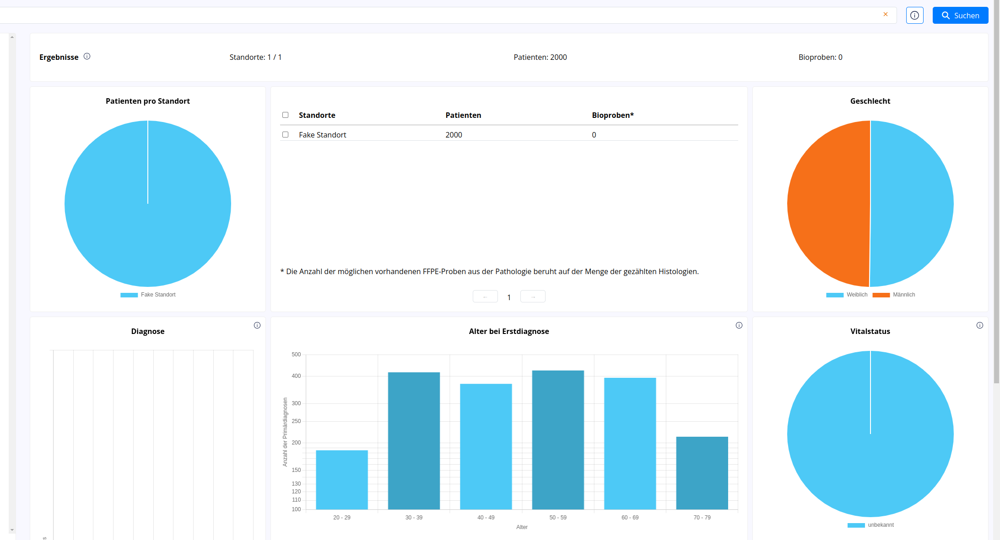

# Testing with Data

To locally test with fake data the following changes have to be made:

```diff
diff --git a/packages/demo/public/options-dev.json b/packages/demo/public/options-dev.json
index 270638e..0cdb708 100644
--- a/packages/demo/public/options-dev.json
+++ b/packages/demo/public/options-dev.json
@@ -21,7 +21,8 @@
         "wuerzburg": "Würzburg",
         "mannheim": "Mannheim",
         "dktk-test": "DKTK-Test",
-        "hamburg": "Hamburg"
+        "hamburg": "Hamburg",
+        "DKTK": "Fake Standort"
     },
     "catalogueKeyToResponseKeyMap": [
         [
@@ -71,7 +72,8 @@
                 "wuerzburg": "Würzburg",
                 "mannheim": "Mannheim",
                 "dktk-test": "DKTK-Test",
-                "hamburg": "Hamburg"
+                "hamburg": "Hamburg",
+                "DKTK": "Fake Standort"
             }
         },
         "gender": {
@@ -255,36 +257,11 @@
         ]
     },
     "backends": {
-        "customBackends": [
-            "someUrl"
-        ],
-        "spots": [
-            {
-                "name": "DKTK",
-                "backendMeasures": "DKTK_STRAT_DEF_IN_INITIAL_POPULATION",
-                "url": "http://localhost:8055",
-                "sites": [
-                    "berlin-test",
-                    "dresden",
-                    "essen",
-                    "frankfurt",
-                    "freiburg",
-                    "hannover",
-                    "mainz",
-                    "muenchen-lmu",
-                    "muenchen-tum",
-                    "ulm",
-                    "wuerzburg",
-                    "mannheim",
-                    "hamburg"
-                ]
-            }
-        ],
         "blazes": [
             {
                 "name": "DKTK",
-                "backendMeasures": "DKTK_STRAT_DEF_IN_INITIAL_POPULATION",
-                "url": "http://localhost:8080"
+                "backendMeasures": "define InInitialPopulation:",
+                "url": "http://localhost:8080/fhir"
             }
         ]
     },
diff --git a/packages/demo/src/AppCCP.svelte b/packages/demo/src/AppCCP.svelte
index 2477f53..3cab33b 100644
--- a/packages/demo/src/AppCCP.svelte
+++ b/packages/demo/src/AppCCP.svelte
@@ -5,12 +5,13 @@
         LensDataPasser,
     } from "../../../dist/types";
     import {
-        dktkDiagnosisMeasure,
-        dktkMedicationStatementsMeasure,
-        dktkPatientsMeasure,
-        dktkProceduresMeasure,
-        dktkSpecimenMeasure,
-        dktkHistologyMeasure,
+        patientsMeasure,
+        // dktkDiagnosisMeasure,
+        // dktkMedicationStatementsMeasure,
+        // dktkPatientsMeasure,
+        // dktkProceduresMeasure,
+        // dktkSpecimenMeasure,
+        // dktkHistologyMeasure,
     } from "./measures";
 
     /**
@@ -25,7 +26,7 @@
         optionsFilePath = "options-ccp-prod.json";
     } else {
         catalogueUrl = "catalogues/catalogue-dktk-staging.json";
-        optionsFilePath = "options-ccp-demo.json";
+        optionsFilePath = "options-dev.json";
     }
 
     /**
@@ -63,12 +64,12 @@
         {
             name: "DKTK",
             measures: [
-                dktkPatientsMeasure as MeasureItem,
-                dktkDiagnosisMeasure as MeasureItem,
-                dktkSpecimenMeasure as MeasureItem,
-                dktkProceduresMeasure as MeasureItem,
-                dktkMedicationStatementsMeasure as MeasureItem,
-                dktkHistologyMeasure as MeasureItem,
+                patientsMeasure as MeasureItem,
+                // dktkDiagnosisMeasure as MeasureItem,
+                // dktkSpecimenMeasure as MeasureItem,
+                // dktkProceduresMeasure as MeasureItem,
+                // dktkMedicationStatementsMeasure as MeasureItem,
+                // dktkHistologyMeasure as MeasureItem,
             ],
         },
     ];
diff --git a/packages/demo/src/measures.ts b/packages/demo/src/measures.ts
index ab5acc7..2a75d4b 100644
--- a/packages/demo/src/measures.ts
+++ b/packages/demo/src/measures.ts
@@ -64,7 +64,6 @@ First(
 
 define AgeClass:
 if (Patient.birthDate is null) then 'unknown' else ToString((AgeInYears() div 10) * 10)
-if (PrimaryDiagnosis.onset is null) then 'unknown' else ToString((AgeInYearsAt(FHIRHelpers.ToDateTime(PrimaryDiagnosis.onset)) div 10) * 10)
 
 define PatientDeceased:
 First (from [Observation: Code '75186-7' from loinc] O return O.value.coding.where(system = 'http://dktk.dkfz.de/fhir/onco/core/CodeSystem/VitalstatusCS').code.first())
```

Save the diff to a file and apply it with `git apply file.diff`.

Then run this docker container which will start blaze and import fake data:

```
docker compose -f docker-compose.dev.yml --profile blaze up
```

Wait until the fake data import is complete:

```
test-data-loader-1  | total                             : 40928
test-data-loader-1  | Done
test-data-loader-1 exited with code 0
```

Then start lens in another terminal:

```
npm run dev
```

You can now see some fake data when clicking the "Suchen" button:

